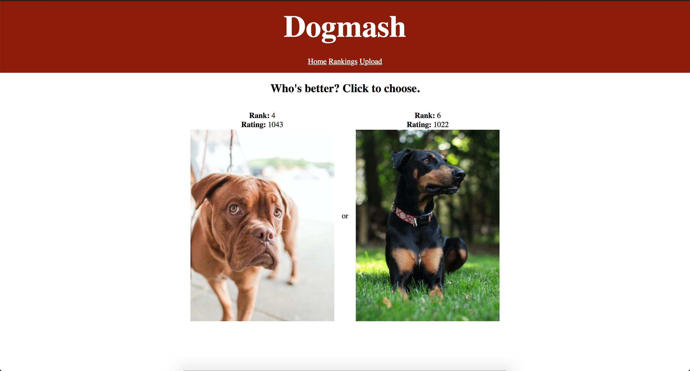
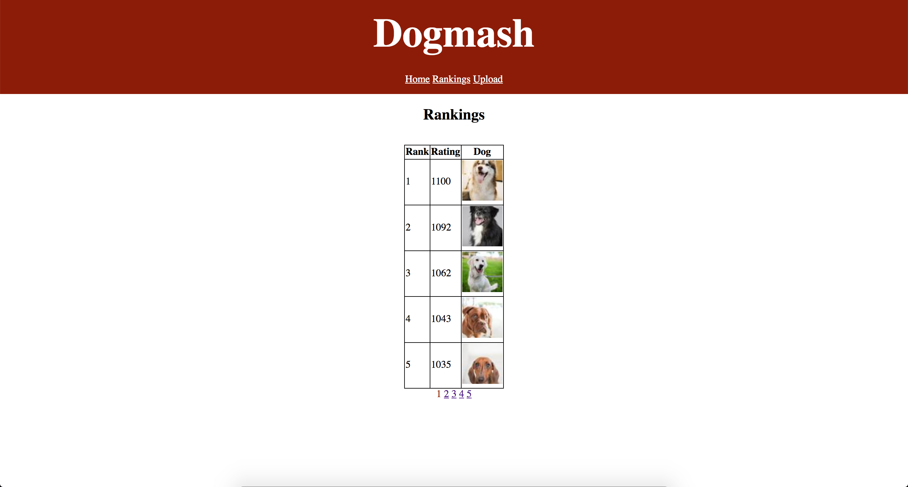
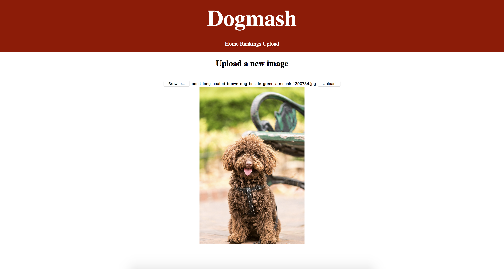

# Dogmash
This is a clone of Mark Zuckerberg's website [Facemash](https://en.wikipedia.org/wiki/History_of_Facebook#FaceMash), built using Django as a quick* exercise in file handling. Dogs are rated using the [Elo rating system](https://en.wikipedia.org/wiki/Elo_rating_system) and users can upload their own images.

\* _Hence the lack of design._

## Prerequisites
- Python version >= 3.8.2
- Install the dependencies with `pip install -r requirements/main.txt`

## Running the app
First apply the database migrations.
```bash
python manage.py migrate
```

Then start the development server.
```bash
python manage.py runserver
```

## Screenshots




